## uni app 入门

### uni-app 介绍

`uni-app` 是一个使用 [Vue.js](https://vuejs.org/) 开发所有前端应用的框架，开发者编写一套代码，可发布到iOS、Android、H5、以及各种小程序（微信/支付宝/百度/头条/QQ/钉钉/淘宝）、快应用等多个平台。


### uni-app 初体验

体验的方式有两种,

1. 使用 `基于node的脚手架来` 创建项目 使用`vs code` 来编辑代码 使用 `微信小程序开发者工具`来预览项目
2. 使用 uni-app 配套开发者工具  `hbuilder` 来创建 和 开发项目 使用 `微信小程序开发者工具` 来预览项目


1. 全局安装 vue的脚手架

   ```js
   npm install -g @vue/cli
   ```

2. 创建 uni-app 的项目

   ```js
   vue create -p dcloudio/uni-preset-vue my-project
   ```

3. 运行 uni-app 项目

   ```js
   npm  run dev:mp-weixin
   ```

4. 微信小程序 开发者工具 预览项目

   导入的文件路径

   ```js
   my-project\dist\dev\mp-weixin
   ```

   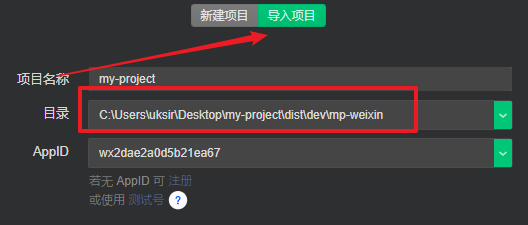

5. 预览成功

   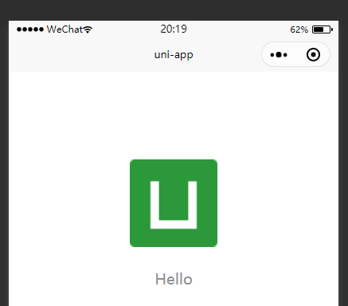

   


### uni app 项目的运行过程

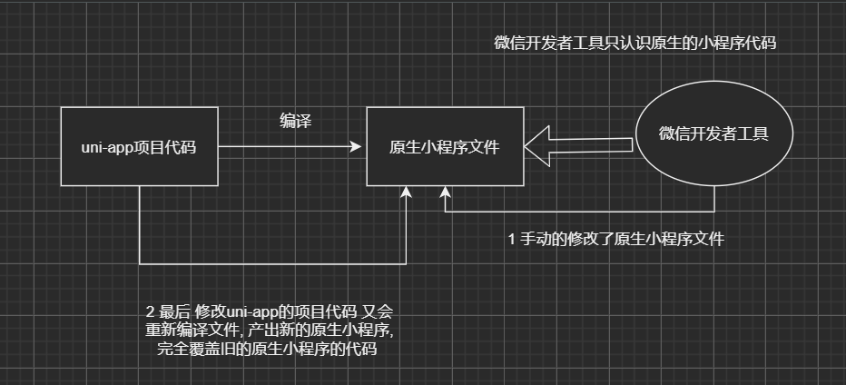


### uni app 全局配置文件 或者 页面配置文件 

`pages.json`

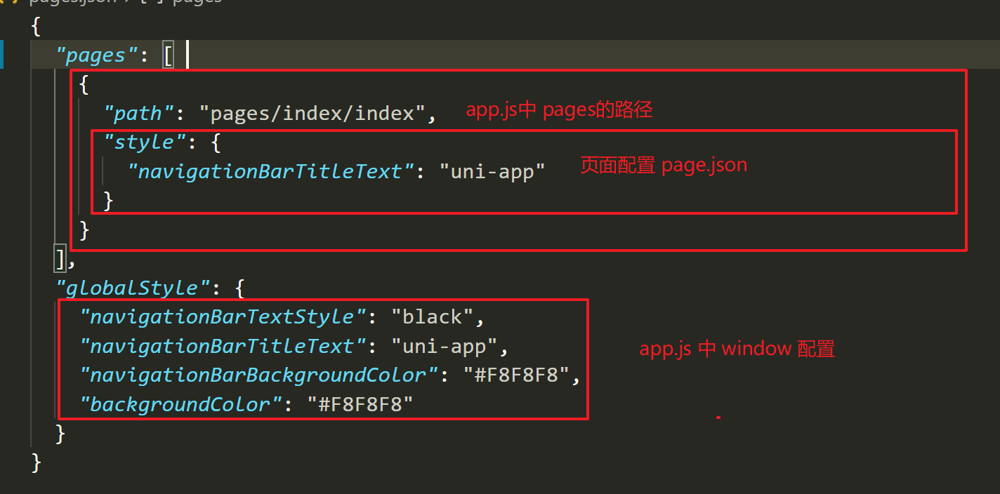

### uniapp 项目配置

uni-app 中  `manifest.json` ->  原生小程序中 `project.config.json`

修改项目的编译配置或者 `appid`

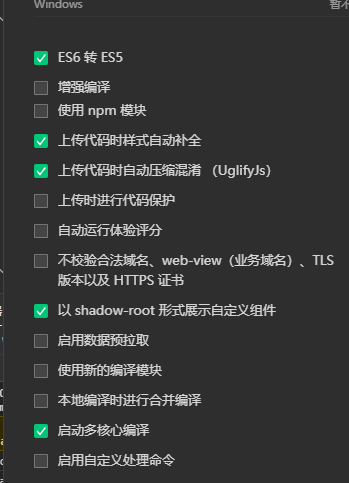


### uniapp的开发体验

vue的语法 + 小程序的api + 小程序标签

1. vue语法

   ```
   v-if v-for @tap @changed 
   ```

2. 小程序标签

   ```
   view text navigator 
   ```

3. 小程序api

   ```
   wx.navigator 
   ```

### uni-app 项目目录结构

```
│  App.vue             应用配置，用来配置App全局样式以及监听
│  main.js               Vue初始化入口文件
│  manifest.json   配置应用名称、appid、logo、版本等打包信息
│  pages.json        配置页面路由、导航条、选项卡等页面类信息
│  uni.scss             内置的sass变量，可以直接使用
│  
|─pages               
│  └─index
│          index.vue  页面组件
│          
└─static                 静态资源
        logo.png

```

### uni-app 中 使用 sass

`sass` 和 `less` 一样 都是  css预处理器 本质是功能没有太大差别。其中，想要在uni-app中使用 sass，需要进行如下配置

1. 下载安装依赖

   ```js
   npm i node-sass sass-loader
   ```

2. 查看 uni-app 中 内置的 sass 变量  `src\uni.scss`

   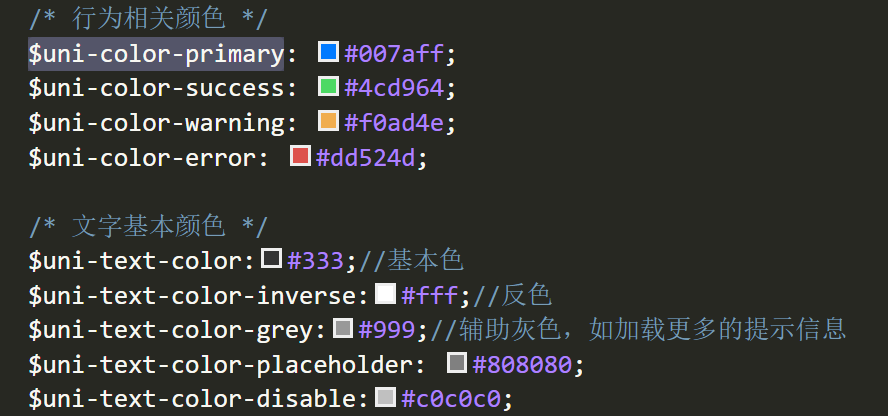

3. 页面中使用

   ```vue
   <style lang="scss">
   	.content {
   		background-color: $uni-color-primary;
   	}
   </style>
   ```


### uni-app 生命周期

- `uni-app`框架的生命周期结合了 `vue` 和 微信小程序的生命周期
- 全局的`App.vue`中 使用 `onLaunch` 表示应用启动时
- 页面中 使用 `onLoad` 或者 `onShow`  分别表示 页面加载完毕时 和页面 显示时
- 组件中使用 `mounted` 组件挂载完毕时


### uni-api

uni-api 指的是uni-app 针对一些 微信小程序小程序所封装(不局限于微信小程序)的一系列API。因为

- 原生的小程序api不支持promise形式的调用（需要自己封装）
- 原生的微信小程序api不支持跨平台

 因此，就有了uni-api。

#### 对比

- [uni-api 列表](https://uniapp.dcloud.io/api/README?id=api-%e5%88%97%e8%a1%a8)
- [原生小程序的api列表](https://developers.weixin.qq.com/miniprogram/dev/api/)


## vant weapp

> 轻量、可靠的小程序 UI 组件库

Vant 是**有赞前端团队**开源的移动端组件库，于 2016 年开源，已持续维护 4 年时间。Vant 对内承载了有赞所有核心业务，对外服务十多万开发者，是业界主流的移动端组件库之一。

目前 Vant 官方提供了 [Vue 版本](https://vant-contrib.gitee.io/vant)和[微信小程序版本](http://vant-contrib.gitee.io/vant-weapp)，并由社区团队维护 [React 版本](https://github.com/mxdi9i7/vant-react)。

### 体验

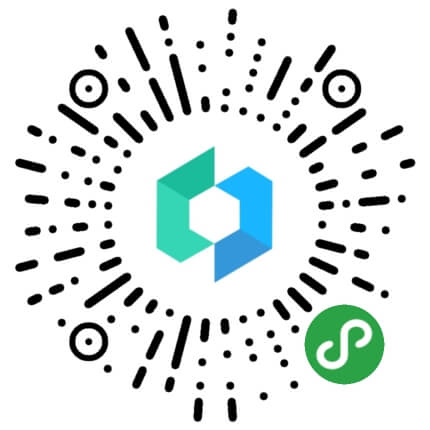


### 在原生小程序中使用 

> [原生小程序中 可以使用 npm](#原生微信小程序使用-npm)

1. 通过 npm 安装

   需要注意的是 **package.json** 和 **node_modules** 必须在 **miniprogram** 目录下

   ```js
   # 通过 npm 安装
   npm i @vant/weapp -S --production
   
   # 通过 yarn 安装
   yarn add @vant/weapp --production
   
   # 安装 0.x 版本
   npm i vant-weapp -S --production
   ```

2. 构建 npm 包

   打开微信开发者工具，点击 **工具 -> 构建 npm**，并勾选 **使用 npm 模块** 选项，构建完成后，即可引入组件

   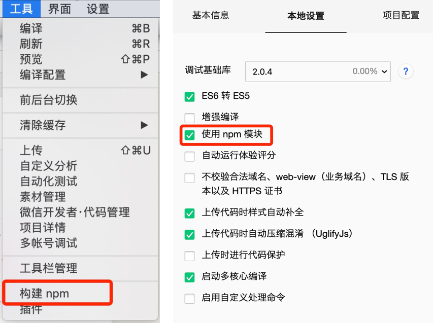

3. 修改 app.json

   将 app.json 中的 `"style": "v2"` 去除，小程序的[新版基础组件](https://developers.weixin.qq.com/miniprogram/dev/reference/configuration/app.html#style)强行加上了许多样式，难以去除，不关闭将造成部分组件样式混乱。


### uni app 中使用 vant weapp

1. 在uni-app项目的src内新建文件夹 `wxcomponents`

   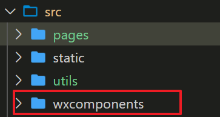

2. 下载 [vant weapp](https://github.com/youzan/vant-weapp)   中 编译好的 `dist` 文件

   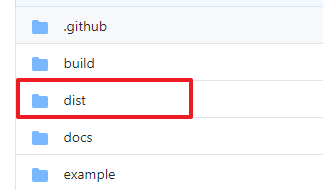

3. 将其直接复制到 `wxcomponents` 文件夹内

   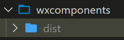

4. 在 `App.vue` 中 引入 `vant weapp` 通用样式

   ```html
   <style>
   @import "@/wxcomponents/dist/common/index.wxss"
   	/*每个页面公共css */
   </style>
   ```

5. 在页面配置中 来声明要引入的组件  `pages.json`

   ```json
   {
       "path": "pages/index/index",
       "style": {
           "navigationBarTitleText": "黑马-万少",
           "usingComponents": {
               "van-button": "/wxcomponents/dist/button/index"
           }
       }
   },
   ```

6. 页面中直接使用

   ```html
   <van-button type="default">默认按钮</van-button>
   <van-button type="primary">主要按钮</van-button>
   <van-button type="info">信息按钮</van-button>
   <van-button type="warning">警告按钮</van-button>
   <van-button type="danger">危险按钮</van-button>
   ```

7. 效果如下

   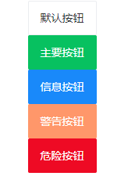

## uni-app 多端开发

### [条件编译](https://uniapp.dcloud.io/platform?id=条件编译)

条件编译是用特殊的注释作为标记，在编译时根据这些特殊的注释，将注释里面的代码编译到不同平台。

**写法：**以 #ifdef 或 #ifndef 加 **%PLATFORM%** 开头，以 #endif 结尾。

- \#ifdef：if defined 仅在某平台存在
- \#ifndef：if not defined 除了某平台均存在
- **%PLATFORM%**：平台名称

| 条件编译写法                                             | 说明                                                         |
| -------------------------------------------------------- | ------------------------------------------------------------ |
| #ifdef **APP-PLUS** 需条件编译的代码 #endif              | 仅出现在 App 平台下的代码                                    |
| #ifndef **H5** 需条件编译的代码 #endif                   | 除了 H5 平台，其它平台均存在的代码                           |
| #ifdef **H5** \|\| **MP-WEIXIN** 需条件编译的代码 #endif | 在 H5 平台或微信小程序平台存在的代码（这里只有\|\|，不可能出现&&，因为没有交集） |

**%PLATFORM%** **可取值如下：**

| 值                      | 平台                                                         |
| :---------------------- | :----------------------------------------------------------- |
| APP-PLUS                | App                                                          |
| APP-PLUS-NVUE           | App nvue                                                     |
| H5                      | H5                                                           |
| MP-WEIXIN               | 微信小程序                                                   |
| MP-ALIPAY               | 支付宝小程序                                                 |
| MP-BAIDU                | 百度小程序                                                   |
| MP-TOUTIAO              | 字节跳动小程序                                               |
| MP-QQ                   | QQ小程序                                                     |
| MP-360                  | 360小程序                                                    |
| MP                      | 微信小程序/支付宝小程序/百度小程序/字节跳动小程序/QQ小程序/360小程序 |
| quickapp-webview        | 快应用通用(包含联盟、华为)                                   |
| quickapp-webview-union  | 快应用联盟                                                   |
| quickapp-webview-huawei | 快应用华为                                                   |

**支持的文件**

- .vue
- .js
- .css
- pages.json
- 各预编译语言文件，如：.scss、.less、.stylus、.ts、.pug

**注意：** 条件编译是利用注释实现的，在不同语法里注释写法不一样，js使用 `// 注释`、css 使用 `/* 注释 */`、vue/nvue 模板里使用 `<!-- 注释 -->`；

### [API 的条件编译](https://uniapp.dcloud.io/platform?id=api-的条件编译)

```javascript
// #ifdef  %PLATFORM%
平台特有的API实现
// #endif
```

示例，如下代码仅在 App 下出现:

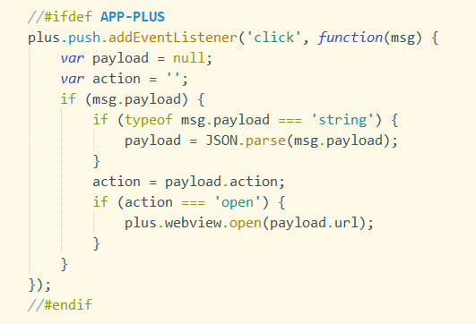

示例，如下代码不会在 H5 平台上出现：

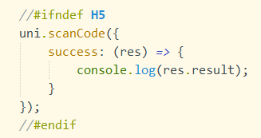

除了支持单个平台的条件编译外，还支持**多平台**同时编译，使用 || 来分隔平台名称。

示例，如下代码会在 App 和 H5 平台上出现：

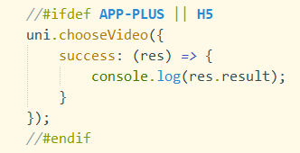

### [组件的条件编译](https://uniapp.dcloud.io/platform?id=组件的条件编译)

```html
<!--  #ifdef  %PLATFORM% -->
平台特有的组件
<!--  #endif -->
```

示例，如下公众号关注组件仅会在微信小程序中出现：

```html
<view>
    <view>微信公众号关注组件</view>
    <view>
        <!-- uni-app未封装，但可直接使用微信原生的official-account组件-->
        <!-- #ifdef MP-WEIXIN -->
                <official-account></official-account>
            <!-- #endif -->
    </view>
</view>
```

### [样式的条件编译](https://uniapp.dcloud.io/platform?id=样式的条件编译)

```css
/*  #ifdef  %PLATFORM%  */
平台特有样式
/*  #endif  */
```

**注意：** 样式的条件编译，无论是 css 还是 sass/scss/less/stylus 等预编译语言中，必须使用 `/*注释*/` 的写法。

正确写法

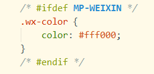

错误写法

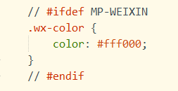

### [pages.json 的条件编译](https://uniapp.dcloud.io/platform?id=pagesjson-的条件编译)

下面的页面，只有运行至 App 时才会编译进去。

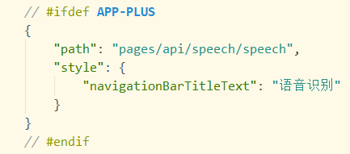

不同平台下的特有功能，以及小程序平台的分包，都可以通过 pages.json 的条件编译来更好地实现。这样，就不会在其它平台产生多余的资源，进而减小包体积。

json的条件编译，如不同平台的key名称相同，cli项目下开发者自己安装的校验器会报错，需自行关闭这些校验器对json相同key的校验规则。如果使用HBuilderX的校验器，无需在意此问题，HBuilderX的语法校验器为此优化过。

### [static 目录的条件编译](https://uniapp.dcloud.io/platform?id=static-目录的条件编译)

在不同平台，引用的静态资源可能也存在差异，通过 static 的的条件编译可以解决此问题，static 目录下新建不同平台的专有目录（目录名称同 `%PLATFORM%` 值域,但字母均为小写），专有目录下的静态资源只有在特定平台才会编译进去。

如以下目录结构，`a.png` 只有在微信小程序平台才会编译进去，`b.png` 在所有平台都会被编译。

```
┌─static                
│  ├─mp-weixin
│  │  └─a.png     
│  └─b.png
├─main.js        
├─App.vue      
├─manifest.json 
└─pages.json     
    
```

### [整体目录条件编译](https://uniapp.dcloud.io/platform?id=整体目录条件编译)

如果想把各平台的页面文件更彻底的分开，也可以在uni-app项目根目录创建`platforms`目录，然后在下面进一步创建`app-plus`、`mp-weixin`等子目录，存放不同平台的文件。

**注意**

- `platforms`目录下只支持放置页面文件（即页面vue文件），如果需要对其他资源条件编译建议使用[static 目录的条件编译](https://uniapp.dcloud.io/platform?id=static-目录的条件编译)


## 原生小程序 转 uni-app

`uni-app`可以多端输出，也欢迎各平台之前的老项目向uni-app转换迁移。

**vue h5项目转换uni-app指南：**https://ask.dcloud.net.cn/article/36174

**微信小程序转换uni-app指南及转换器：**https://ask.dcloud.net.cn/article/35786

**wepy转uni-app转换器：**https://github.com/zhangdaren/wepy-to-uniapp

**mpvue 项目（组件）迁移指南、示例及资源汇总：** https://ask.dcloud.net.cn/article/34945


## 原生微信小程序使用 npm

#### npm 初始化小程序

```js
npm init 
```

#### 使用 npm 包

1. 在小程序 package.json 所在的目录中执行命令安装 npm 包：

```text
npm install
```

1. 点击开发者工具中的菜单栏：工具 --> 构建 npm 
   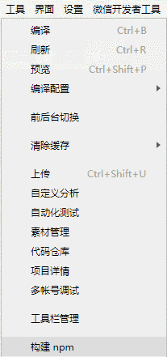
2. 勾选“使用 npm 模块”选项： 
   ![use npm](data:image/png;base64,iVBORw0KGgoAAAANSUhEUgAAAPYAAAC4CAYAAADQQBHUAAAAAXNSR0IArs4c6QAAAARnQU1BAACxjwv8YQUAAAAJcEhZcwAADsMAAA7DAcdvqGQAABWNSURBVHhe7Z1NjyVFdobrJ7Dxfn4B8k+YTbP2pll7w9IyGjweWcgCWbK8QF660cibYWlZLY2EhCyPZPNh42G6sVuYL41laDG2aRajMZZhBAO67qfgLR9OncjMc+uDqNsv0qN7M+LEiYjseDKzSkXG0eeff74zxszNZ5991sJiGzM5lbhrWGxjJqUSdisW25gJqWTtYLGNmZBK1g4W25gJqWTtYLGNmZBK1g4W25gJqWTtYLGNmZBK1g4W25gJqWTtYLGNmZBK1g4W25gJqWTtYLGNmZBK1g4W25gJqWTtYLGNmZBK1g4W25gJqWTtYLGNmZBK1g4tsf/yv366+63bf7I7+qcfbIJY2lS5ZuLNN9/cPfHEE7uPP/54U7kxF00la4eW2B2pBW2qXBUffvjh7pFHHtkdHR2d4rHHHjsRLMc9/PDDxxLGXE899VTZtuK55547Zmt5hH7pX31FGIPiXnzxxW/U5TFVc1/r2xwulawdWmJX4m6hylWhxY0EVT1UMXyPcmchESxKJrJsQJ4bN26cKocqB31eu3bt1IUlQj+MmbGrjFxRbtr76cCIStYO5y/2qz/YPf2Ln+wev/v8SVmVq2KL2Ajw6KOPfkMSQBRk3pIjQjxts1Cj8swWsRlXviiQn3moHePNMebBpZK1w/mJfV/oo3/8w93v/vyvdvz39Ac/OamrclVskRIRuKuOHlNH4o8gj6TiU2Oo7tjVIz/HW8Su2kaIGc3JPHhUsnY4u9hfC3308h/sfvv2n+9+9ZtPd3f+9z+/KqPufkyVq2JJqig732NdvNNRR46bN2+e1I9+xqY/6viU2Kp75plnFkUUxCBtHA9kkckf62Nfqr9+/fpJ/drvBcxhU8naYW+xv/vmD0+EPvq77+0e+vs/2v3L//zH7r9/8+vdQ6/+8Vd1X8dWuSokdl70S0RhaAd8j7JzJ4zHopKS/t96660T4XObDDnW7tiRePHik2MEpr84RuZRjdk8GFSydthL7O/c/rPjx+3H/+3Hu6O//f3d0Qu/t/vRL356XPbdf/6L3dEr3z+5W1+02AIJkOP27dunHsWRbu3xnPbqtxIeqkflrthCcx09fm8ZszlcKlk77HfHvn83/tGHPzsW+Xdu/XD3+L/+9fH3p//9b766g4e79XmLPbr70gax7969e+puq7qlR1tyIm/1s/CSZGti625czYk+l8T2b8kfXCpZO+wt9tFLT+zu3H/0/tXnnx5L/eOP3tgdvfjEKamhylWxRWwWPPJFISSPyrIwfK8Eop94R1a/cRxLUsOa2EDf+YIR21XzHo3ZPBhUsnbYT2wes//h+7uHXn5yd/fTX+7u/vqXu4deefK4LD6CiypXhRZ4lE1QLrmquHwx0B0Yqjt8hpgo9q1bt04ex5cEQ8zqsR3iUwK5Y12cD+Q5bRmzOVwqWTvs/cszyf2dn/3pMSOpoco1G1HsiITz3dNcJpWsHVpin/qTUkTm0RsGUnf+pNQY8xWVrB1aYh/q/wRizGxUsnZoiW2MuRwqWTtYbGMmpJK1g8U2ZkIqWTtYbGMmpJK1g8U2ZkIqWTtYbGMmpJK1g8U2ZkIqWTtYbGMmpJK1g8U2ZkIqWTtYbGMmpJK1g8U2ZkIqWTtYbGMmpJK1g8U2ZkIqWTtYbGMmpJK1g8U2ZkIqWTtYbGMmpJK1g8U2ZkIqWTtYbGMmpJK1g8U2ZkIqWTu0xP423nnG20O3vCGU1wDnF+yP3jwqeANp3FyAfmhDDj7j64Gpi68PBrbbrV49vLY5QSSPAWjLXPQecuqeffbZk3pgPEtzE9qDjPksjSv32WWp/aiO4/xvNoLY/D75Q6aStUNL7I7UgjZVrq1sFZsYkUWLRBn4Tv58zEJjU7/87m/FLI2HBUhbvhMb+67ybREb6FNj7wgRNxfU+ckxsCUndYw1zkkbIVRjjlT5t/QJnBvOHeeVzRtGfRwSlawdWmJX4m6hyrWVLWJXi2pNwFGbeFejfRQfOJZgihkd86n2lcCj8mps1JOLz1jHcdxoYAsaE2Ot6jNxfiOqMQN9xVzx/BJLGx1XUEcb/VvS5kHY06yStcP5i/3q/hvfV7Aw9I86goWX74Zr2+BWbYhnEbFw4mJcWlSxn7y4K7GJj7kj1D/55JPfKCMf5bEssiYd/Y9imNfauaV+Sx/V2HLu/G/JeeKOXz3JxPqch/J9NkK8SlSydjg/sb/ePOAsG99XjBaNhNEVXY9qVWyE2Hv37p20YdHmn5NHC5k+1S/QN8dalHxyrDsQeRQvsfMCrsr5PnrkJN+aaJElManL0mSW2kfyRS3nJocE5vcFfBJLG9AjveJpm8sitCdf/Pc4JCpZO5xdbO0Gcg4b31fwD7e0+KhDjCgHi0E/51ZUbYDvI6FYmFF+teUzlgv6yG1YiHnvbeWI46DdaFFXYud+BHn5Bd/o/FFetcuov6V+GP9IbMqYD+0p4xy///77x+W04aKgsRDDHEXuK6L58amL6aFQydphb7EvYuP7ijWxufpnWbRIMojFNrssBhZWbAMsDsq0kCM8QrMIqaMN4xotJuqI0yKljDbqb1Qe22vMio3zELoDql2+a0LsK8N5Wjq3QD05YhnHuV2eB30SI6k15jiWKDbHS2OtztMhU8naYS+xL2rj+wotkKpObPlHz3lGbYgZ9Uc5i4825NtX7BiTy/lksVPGjp98Epdz6zhSiZ3liTCfeKEYEfsjD2PQhVF1uR+NU7+DoC/KyKfzuzS2TD5Ph04la4f97tj378YXsfF9BYthJJqI/+gskkoGGLWJ5bSLd8K4+LLYlGcJyEk5caB+R/3lcvrgiYIc9B1jgXxxbhHGmNvlsjyftXOrOeuY9voxh++Iq7iYK49TeZinftyJY1GcoC7e6UeMzsVVp5K1w95iX8TG9xUskLXFl+VgoXAMo5/BchuhtuqThSM54+KkrFqQak8cxEWYH50hj4MfLbgbSkb6jDkycW58ZrGBHJpDno/mOUJz5jv5actYNS793iD/boI4tct5xJLYmXyeDp1K1g77ic1j9gVsfF/BAllbfKN/dF31q/ZLC0XtJIHaazFnoSLk0yKPEo36q8pHgkIWJkI7cmmMQCy5EZDxj+azhPrTeaEs59CxxpHHT30eN/UWu6aStcPevzyT3Oe58T2LLi6oNdakEXExi7U2LEL6iHdZLU6OyRkXZBy7xjUiC5jjKzEEsVkQ9Y10VRuQlHk++bxkKiEj1Gn86oOxML94fqo8I7GJ07nZwtocriKVrB1aYp/6k1JE5tEbBlKf9U9KjXkQqWTt0BLbG98bczlUsnZoiW2MuRwqWTtYbGMmpJK1g8U2ZkIqWTtYbGMmpJK1g8U2ZkIqWTtYbGMmpJK1g8U2ZkIqWTtYbGMmpJK1g8U2ZkIqWTtYbGMmpJK1g8U2ZkIqWTtYbGMmpJK1g8U2ZkIqWTtYbGMmpJK1g8U2ZkIqWTtYbGMmpJK1g8U2ZkIqWTtYbGMmpJK1g8U2ZkIqWTu0xPbG9998OybvLNdbOSP5DZ1L5DFkyDN6Y+kWltp33gaqN5GOxkuu6r3pZj8qWTu0xO5ILWhT5drKVrGJEdXCFFF0vmvBxmNkYLeLaqESszQeBNJOGcTGvqt8I1HE6BW9EerIEfvSq4jXxI7z3wJzpx3faRv7zCydJ7NMJWuHltiVuFuocm1li9jV4l0TcNQm3m1pnxc+x1rYihkd86n2I4GrcnJUomRivyO6Yi/FM0bi2VOMTREY92gMzAGqOrNOJWuH8xf7VW98r+MoDm3ITXzMHaGeHFukoH4klaDvqh/ljuMTS2LzJEJ57JvvOYc5O5WsHc5P7K83D/DG9/+/Q0gUR2LHi8KoHFkk34go1xJZ1Jg7jm8ULxgf54vzo/Ya++i859xmO5WsHc4utnYD8cb334A+chvE2LLxPW1juxESO/cjlHdN7FF7oZ/XacNjOPID+UEXMmK0+6Y5G5WsHfYW2xvf17ttgmSROJTRRv2NytU+yjeC+jxOjnO7nD+ezyqeOY0exYnXuSSGXHyqj3yu45xMj0rWDnuJ7Y3vzyZ2jKnGQT9RkhG0VxvGQs6tG9KrnzzXKLbmqzraxnjl1vnQHKo5mR6VrB32u2Pfvxt74/uL2fge6GdtzhqLjhmnfvzgux6Jcy7Go3bxu4hix+8xRujcaA7xPPiOfTYqWTvsLbY3vq/v2GpPHKwt9mocWcYKjYXv9Ml4yEG5+lrakJ42lbS5XPJqrpoT+fkusdU/MdWcTI9K1g77ic1jtje+P1nsEfJJJrVXedVfVR77WYL8xGu8lOWx6hiitLSt5pDFFowPmTUfIEZikyuOzXfss1HJ2mHvX55Jbm98/1V8HLvGNYJ2UYQcTz95vBmNpaoD6pQ3ii+ZqSNG81yjmlMUm3qdJz6Xzq1Zp5K1Q0vsU39Sisg8esNA6rP+SakxDyKVrB1aYnvje2Muh0rWDi2xjTGXQyVrB4ttzIRUsnaw2MZMSCVrB4ttzIRUsnaw2MZMSCVrB4ttzIRUsnaw2MZMSCVrB4ttzIRUsnaw2MZMSCVrB4ttzIRUsnaw2MZMSCVrB4ttzIRUsnaw2MZMSCVrB4ttzIRUsnaw2MZMSCVrB4ttzIRUsnaw2MZMSCVrB4ttzIRUsnaw2MZMSCVrh5bYl/XOs/iGzaWyWFe9WTMz2ytx89tI9bZP3iI6etNn9QZT3hbqPbMOi0rWDi2xO1IL2lS5lmBxI2ssWxM71lXvxh6J8m0iSRkTF53qYgRxUzyL/WBQydqhJXYl7haqXCMk4NYtcZH4qoutY8bWuWPzuXReYjtztahk7XD+Yr96to3vR3fmtTt2tcAzszyKc8HRC/yB71yI4lgjzK9qowtXvGPHi0Ps01wtKlk7nJ/YX28ecJaN71mM3G20MPkeF3gkSnrWOzZtEUOPw1EactMuikcZdcSwnQ9tVac7ajyOfQnNL959q1jK1J+Oc5zFPjwqWTucXWztBnIOG9+zYK9fv36yMKOcUV7q+H6eYscLBcfEkofcUVByXrt27fgTuAioLsdyPHpKUFvmSzzoYpAhj9opNuaK86cvvlvsq00la4e9xb6Ije/ZxJ6frbUwkata6JDv2FVMZiQZ/UkMIF8UO7cjFrmi5JRXx9zRqz5pr4sYSPAqrhJ7bc7xqcNcPSpZO+wl9kVufM+ClWSIJSlYpHrcpJwY1Wmx81313Tt2bJ/F1vccn8VdOxYaC/NRv3xWgkIlto41V8YUx2iuNpWsHfa7Y9+/G1/UxvdRbMTgzkNZXtARyuPiP2+xl+7Y+4hN+a1bt4ZzQvg49gjxUXiN9YUXXihzmatJJWuHvcW+qI3vWagSG5CLhTt6tKwkPm+xkUj15Iw/Y+8jtiAnqI8RzP35558//oznJo6FY+rIpXpzdalk7bCf2DxmX9DG91lsvrOgWcAscgmnehY1Esey8xab7+STZMrL53mIHcsYC33l8Weoi1ID42WsOae5elSydtj7l2eS+zw3vgeJDYiU70Ac604mIXNMFJv6GB/jtiCx44XjvJDYcYyaiySlLD+tVFJHmOdFjdlcDpWsHVpin/qTUkTm0RsGUu/zJ6UzcZFiGzOikrVDS+wHceN7i22+DSpZO7TENsZcDpWsHSy2MRNSydrBYhszIZWsHSy2MRNSydrBYhszIZWsHSy2MRNSydrBYhszIZWsHSy2MRNSydrBYhszIZWsHSy2MRNSydrBYhszIZWsHSy2MRNSydrBYhszIZWsHSy2MRNSydrBYhszIZWsHSy2MRNSydrBYhszIZWsHSy2MRNSydrBYhszIZWsHVpiv/HGG8fvAHvppZd2r7zyyiIvv/zycSxtqlxbIcfa20WJ0Vs+lxht8cP7zNZe91vB20U7bz7Vm0cZb1UfIW+OY3yMM79/jdg4T2L0htPM6BwA+fO7y9dQmy1zMtupZO3QEhtZP/jgg929e/d2H3300SLEEEubKtdWtshAXVyMlagsZvJUi3okzBrkQpSlseV+146hGj8sjTPmoZ7zkb/HmNw+Cko8F60ckyEP879x48bi+9NNn0rWDi2xX3vttd0nn3yy++KLL3ZffvnlIsQQS5sq1wgWVnWnycQ7zz5ix3d5LyFptYirmEx8Dzhjod8ofxwvcdqTTFBWiUL5VrH5Xo2tumNzLnI544vnNKM+dAFgThxXYzN9Klk7tMS+ffv2sbBb/yOWNlWuESyQtbtFXMQc06ZaxJm4eOljrR/qJSTtWOhrC5f6fFEhz0iSahx5PrpQdMSmv/w9xtCGfEuP3owjXqQE7TmX7Bem3IqvLhymTyVrh5bYr7/++vHdeOt/xNKmyjWCxbEmXF6gtImLs5Irt6mEylBP7qquQ+47lnNnzuIwF/Ub5yIRR7J1xKaM79Qzz3ghEZRTT5zOL2Wxfz7jxUZjXDu3ZplK1g5Til0tsky8M+wrdpU3I8G2xou8sDnOZXnckMWQhMxJErFTJzFRttg3P/My11gmznJHpb88XqB/nScxijXbqGTtcCXv2BnaVIs4c5ZH8REs3rUYoN94d87Hgj61IT7H1OtncImtuyMxmgP5dOGinrr8Pcaor3h+FMd5yuXEm8ujkrXDdGKz2ERcXBkWqBa44pWD8vO+Y4t84WHRbxEbiNMY+Ix5BBJzR9b4Y/4sdiTPT0SxYznE80Yfiot5VK42HFfnKUL7aoxmO5WsHaYTWws5LroMi464KLYWP2wVe5Rf5Lyg8cXjzsImJzFRlgr6YEfNKPJWsYnjUT2PS2j88RxQxpjyeVK5+hHvvffeqTJi48/fZn8qWTtMJXYUMi66DIuOxUZ8bKP6qiwv2KX8gnpJABImLnS+x5glyIdYPGqvCcA4eSSOYyR+SWw9QsfxEcux5h3ReITiOE83b948Kc/niZzEqI2OoRqb6VPJ2mEqsRFEiyMvuoziqsXO9y1iV3kzkpactNcvptT/FrHVVxaOHLEPwbF+H0Cb+LuBCmLIkwUEjbFqT7za0Kfi4nlaY6lvsz+VrB2mEptFokUeF11GC55FS0wWg3KJTT0LL4u1lF/E3LSN8TFvBfHA97V+FKc++Iz1zDf/Qkvk2HjBGKGLUmwnumKD+lybp9lOJWuHltj8Uqf7Byq0qXIZY8ZUsnZoif3uu+/u7ty5s3v77bd377zzziLEEEubKpcxZkwla4eW2MaYy6GStYPFNmZCKlk7WGxjJqUSdisW25jJqcRdw2IbcwWo5F3CYhtzBajkXcJiG3NFqAQeYbGNuUJUEldYbGOuGJXIGYttzBWkkjlisY25olRCC4ttzBXHYhtzoFhsYw4Qi23MgWKxjTlwLLYxB4jFNuYAsdjGHCAW25gDxGIbc3B8vvs/bIc8SEtcYgoAAAAASUVORK5CYII=)
3. 构建完成后即可使用 npm 包。

js 中引入 npm 包：

```js
const myPackage = require('packageName')
const packageOther = require('packageName/other')
```

使用 npm 包中的自定义组件：

```json
{
  "usingComponents": {
    "myPackage": "packageName",
    "package-other": "packageName/other"
  }
}
```


